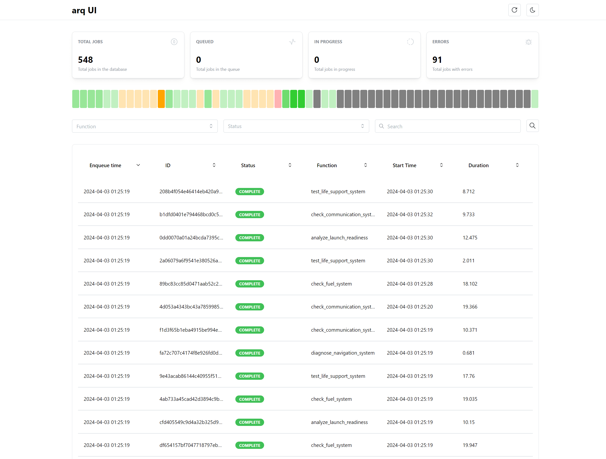

# arq-ui

Этот проект представляет собой простой интерфейс для мониторинга задач, выполняемых с помощью библиотеки [arq](https://github.com/samuelcolvin/arq).



## Возможности

- Предоставление статистики по статусам задач: общее количество, количество задач в очереди, выполняющиеся задачи, задачи с ошибками.
- Визуализация распределения задач по времени в виде временной шкалы.
- Отображение списка задач с возможностями фильтрации, поиска и сортировки.
- Возможность отмены выполнения задач.

## Особенности

- Интерфейс считывает данные непосредственно из Redis, не храня состояние задач, что позволяет отслеживать задачи только за последний час. Планируется добавить функционал постоянного хранения данных.
- `arq` использует библиотеку `pickle` для сериализации данных и влечёт за собой ограничение возможности десериализации объектов пользовательских классов, к которым нет доступа. Если `arq-ui` не может десериализовать данные, задачи с такими данными не будут отображаться в мониторинге.
- Для возможности отмены задач необходимо, чтобы воркер был настроен с параметром `allow_abort_jobs`.
- При обработке большого количества задач (более 50 000) производительность приложения может снизиться.
- Интерфейс не обладает встроенными средствами защиты, поэтому его не рекомендуется размещать в открытом доступе без дополнительных мер безопасности.

## Демонстрация

Демо-версия доступна по адресу [https://demo.arq-ui.florm.io/arq/ui/](https://demo.arq-ui.florm.io/arq/ui/).

## Установка и запуск

### Использование Docker

Для запуска:

```bash
docker pull antonk0/arq-ui
docker run -p 8000:8000 -e REDIS_HOST=redis.host.com -e REDIS_PORT=6379 antonk0/arq-ui
```

Пример docker-compose.yml

```yaml
version: '3'
services:
  arq-ui:
    image: antonk0/arq-ui:latest
    restart: unless-stopped
    environment:
      - REDIS_HOST=redis.host.com
      - REDIS_PASSWORD=your_password
      - REDIS_PORT=6379
      - REDIS_SSL=False
      - REDIS_DB=0
    ports:
      - 8000:8000
```

### Запуск из исходного кода

Скачайте последний стабильный релиз с GitHub релизов, распакуйте и выполните следующие команды:

```bash
pdm install
cd src
pdm run uvicorn main:app --host=0.0.0.0 --port=8000
```

Если pdm не установлен, его можно установить с помощью pip:

```bash
pip install pdm
```

## Настройка

Интерфейс доступен по адресу `/arq/ui/`. Swagger документация API доступна на `/arq/api/docs/`.

Возможные переменные окружения:

| Переменная | Описание | Значение по умолчанию |
| ------ | ------ | ------ |
| REDIS_HOST | Адрес redis сервера | redis |
| REDIS_PORT | Порт redis сервера | 6379 |
| REDIS_PASSWORD | Пароль для подключения к redis | "" (нет пароля) |
| REDIS_SSL | Использовать ли ssl для подключения к redis | False |
| REDIS_DB | Номер базы данных redis | 0 |
| MAX_JOBS | Максимальное количество задач, которые могут быть отображены в интерфейсе | 50000 |
| REQUEST_SEMAPHORE_JOBS | Количество задач, которые могут быть запрошены одновременно | 5 |
| QUEUE_NAME | Название очереди в redis | arq:queue |


User
Есть такой README.md для моего проекта. Исправь ошибки, не правильные формулировки, сделай более понятно.

```
# arq-ui

Это простой интерфейс для мониторинга задач, запущенных через [arq](https://github.com/samuelcolvin/arq). 

Возможности

- Статистика по статусам задач (всего, в очереди, выполняются, ошибки)
- Простая визуализация по минутам виде timeline
- Отображение списках всех задач с возможностью фильтрации, поиска и сортировки
- Возможность отмены задачи

Особенности

- Приложение не хранит состояния задач, а только считывает данные из redis, поэтому работает с задачами только за последний час (в планах есть возможность хранения данных).
- arq использует библиотеку pickle для сериализации данных и влечёт за собой определённое ограничение. В случае, если данные сериализованы объектами пользовательских классов, десериализация таких данных становится невозможной. Если arq-ui не может десериализовать данные, то он пропустит целиком задачи и они не попадут в мониторинг.
- Что бы иметь возможность отменять задачи, ваш воркер должен быть быть сконфигурирован с параметром `allow_abort_jobs`
- Если у вас очень задачь (более 50 000), то приложение может работать медленно
- Приложение никак не защищено, поэтому не стоит его публиковать в интернете без дополнительной защиты

Демо доступно по адресу [https://demo.arq-ui.florm.io/arq/ui/](https://demo.arq-ui.florm.io/arq/ui/)

## Установка и запуск

Самым простым и правильным вариантом установки является запуск в docker контейнере. 

```bash
docker pull antonk0/arq-ui
docker run -p 8000:8000 -e REDIS_HOST=redis.host.com -e REDIS_PORT=6379 antonk0/arq-ui
```

В docker compose

```yaml
version: '3'
services:
  arq-ui:
    image: antonk0/arq-ui:latest
    restart: unless-stopped
    environment:
      - REDIS_HOST=redis.host.com
      - REDIS_PASSWORD=your_password
      - REDIS_PORT=6379
      - REDIS_SSL=False
      - REDIS_DB=0
    ports:
        - 8000:8000
```

Для запуска из исходников скачайте последний стабильный релиз (build.zip) с [https://github.com/antonko/arq-ui/releases](https://github.com/antonko/arq-ui/releases), распакуйте и выполните команды.

```bash
pdm install
cd src
pdm run uvicorn main:app --host=0.0.0.0 --port=8000
```

Используется pdm, если у вас его нет, то установите его через pip
```bash
pip install pdm
```
# Настройка

Основное веб приложение доступно по адресу `/arq/ui/`, кроме этого вы можете посмотреть swagger документацию по API на `/arq/api/docs/`


| Переменная | Описание | Значение по умолчанию |
| ------ | ------ | ------ |
| REDIS_HOST | Адрес redis сервера | redis |
| REDIS_PORT | Порт redis сервера | 6379 |
| REDIS_PASSWORD | Пароль для подключения к redis | "" |
| REDIS_SSL | Использовать ли ssl для подключения к redis | False |
| REDIS_DB | Номер базы данных redis | 0 |
| MAX_JOBS | Максимальное количество задач, которые могут быть отображены в интерфейсе | 50000 |
| REQUEST_SEMAPHORE_JOBS | Количество задач, которые могут быть запрошены одновременно | 5 |
| QUEUE_NAME | Название очереди в redis | arq:queue |


## Development


```
docker compose -f docker-compose.dev.yml build
docker compose -f docker-compose.dev.yml up
```

### Links

| Name | Link |
| ------ | ------ |
| Frontend | [http://localhost:5173/arq/ui](http://localhost:5173/arq/ui) |
| Backend | [http://localhost:8000/arq/api/docs](http://localhost:8000/arq/api/docs) |
| P3X Redis UI | [http://localhost:7843/](http://localhost:7843/) |